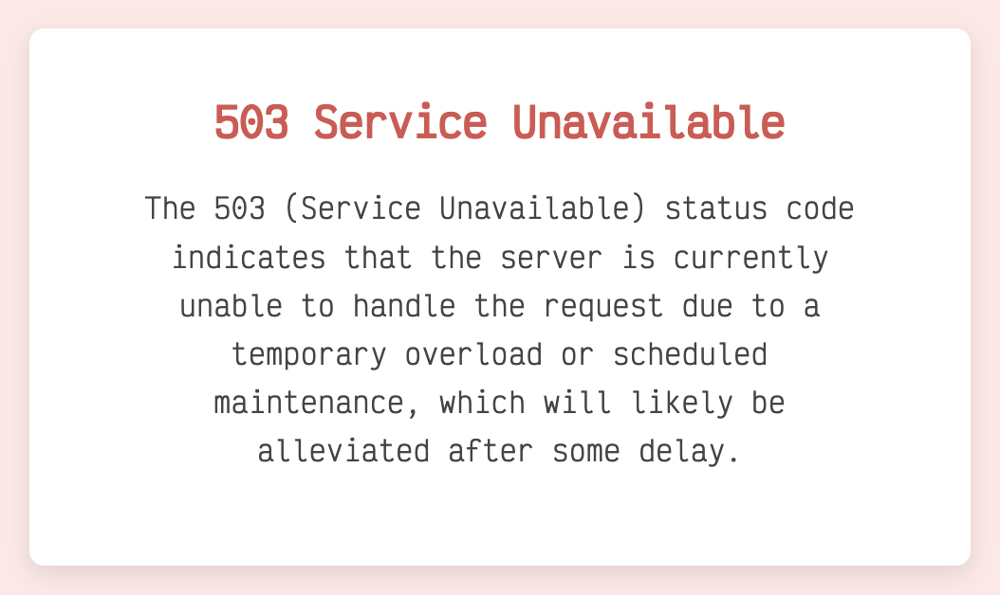

# haproxy-errors-rfc

HAProxy HTML error templates with simple CSS and helpful quotes from
[RFC 9110](https://www.rfc-editor.org/rfc/rfc9110) explaining what the
status codes mean.

## Example



## Installation

This assumes Debian, your paths may differ.

```sh
mv -v /etc/haproxy/{errors,errors_old}
git clone --depth 1 git@github.com:lgrn/haproxy-errors-rfc.git /etc/haproxy/errors
systemctl reload haproxy
```

After this, you can update the templates by simply doing `git pull`.

If you don't like this, you can simply curl the raw files directly.
